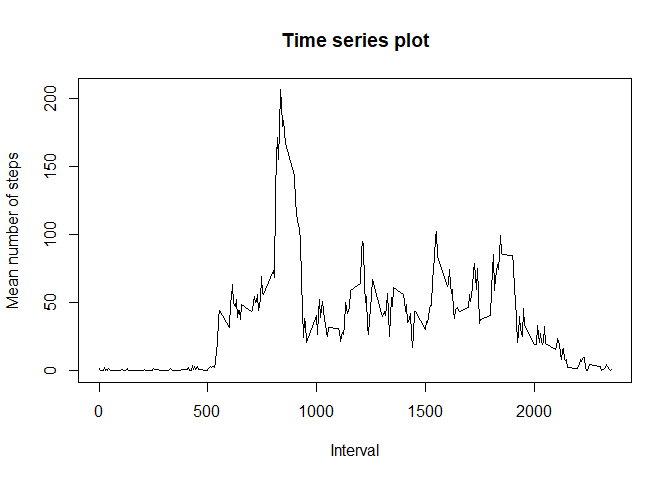

## Loading and preprocessing the data
The project consists of few assignments. I'll just do them step by step and show you the code.   

- Load the data
- Process/transform the data (if necessary) into a format suitable for your analysis


```r
data <- read.csv("C:/Users/jmpol/OneDrive/Bureaublad/cursus_data_science/Course 5 Reproducible research/Week 2/repdata_data_activity/activity.csv")
data$date <- as.Date(data$date,format="%Y-%m-%d")
data$date <- as.POSIXct(data$date,format="%Y-%m-%d")
```

##What is mean total number of steps taken per day? 
For this part of the assignment, you can ignore the missing values in the dataset.

- Calculate the total number of steps taken per day

```r
totalsteps <- with(data, tapply(steps, date, sum))
```

- If you do not understand the difference between a histogram and a barplot, research the difference between them. Make a histogram of the total number of steps taken each day


```r
hist(totalsteps, xlab = "Total number of steps", main = "Histogram on the total number of steps")
```

<!-- -->

- Calculate and report the mean and median of the total number of steps taken per day


```r
mean(totalsteps, na.rm = TRUE)
```

```
## [1] 10766.19
```

```r
median(totalsteps, na.rm = TRUE)
```

```
## [1] 10765
```

##What is the average daily activity pattern? 
- Make a time series plot of the 5-minute interval (x-axis) and the average number of steps taken, averaged across all days (y-axis)


```r
meanperdateinterval <- with(data, tapply(steps, interval, mean, na.rm = TRUE))
plot(unique(data$interval), meanperdateinterval, type = "l", ylab = "Mean number of steps", xlab = "Interval",main = "Time series plot")
```

<!-- -->

- Which 5-minute interval, on average across all the days in the dataset, contains the maximum number of steps?


```r
intervals <- unique(data$interval)
data2 <- as.data.frame(cbind(intervals, meanperdateinterval))
data2[data2$meanperdateinterval == max(meanperdateinterval),]
```

```
##     intervals meanperdateinterval
## 835       835            206.1698
```

##Imputing missing values
Note that there are a number of days/intervals where there are missing values (coded as NA). The presence of missing days may introduce bias into some calculations or summaries of the data.

- Calculate and report the total number of missing values in the dataset (i.e. the total number of rows with NA)


```r
sum(is.na(data$steps))
```

```
## [1] 2304
```

- Devise a strategy for filling in all of the missing values in the dataset. The strategy does not need to be sophisticated. For example, you could use the mean/median for that day, or the mean for that 5-minute interval, etc.

OK, not sophisticated it is. I'll use the mean of the 5 minute interval and use a for-loop to do it.If the number of steps is NA, i'll replace the value with the overall mean of the same interval. 

- Create a new dataset that is equal to the original dataset but with the missing data filled in.


```r
data3 <- data
for(i in 1:nrow(data3)){
        if(is.na(data3$steps[i])){
              interval <- subset(data3, data3$interval == data3$interval[i]) 
              mean <- mean(interval$steps, na.rm = TRUE)
              data3$steps[i] <- mean
        }
        
}
```

- Make a histogram of the total number of steps taken each day and Calculate and report the mean and median total number of steps taken per day. Do these values differ from the estimates from the first part of the assignment? What is the impact of imputing missing data on the estimates of the total daily number of steps?


```r
totalsteps2 <- with(data3, tapply(steps, date, sum))
hist(totalsteps2, main = "Histogram of the total number of steps with imputed NA's", xlab = "Total number of steps")
```

<!-- -->

Do they differ? I like to see them next to each other then. Note the y-axis. Yes the histograms differ. 


```r
par(mfrow = c(1,2))
hist(totalsteps, main = "Steps with removing NA's", xlab = "Total number of steps")
hist(totalsteps2, main = "Steps with imputing NA's", xlab = "Total number of steps")
```

<!-- -->

And to report the **mean** and **median**:

```r
mean(totalsteps2)
```

```
## [1] 10766.19
```

```r
median(totalsteps2)
```

```
## [1] 10766.19
```

The average total steps goes up (no surprise) and the median shifts. 

##Are there differences in activity patterns between weekdays and weekends?
- Create a new factor variable in the dataset with two levels - "weekday" and "weekend" indicating whether a given date is a weekday or weekend day.


```r
data3$weekday <- weekdays(data3$date)
data3$daytype <- "weekday"
weekend <- c("zaterdag", "zondag")
data3$daytype[data3$weekday %in% weekend] <- "weekend"
```

- Make a panel plot containing a time series plot of the 5-minute interval (x-axis) and the average number of steps taken, averaged across all weekday days or weekend days (y-axis). 


```r
subsetweekday <- subset(data3, data3$daytype == "weekday")
subsetweekend <- subset(data3, data3$daytype == "weekend")
meanperweekdayinterval <- with(subsetweekday, tapply(steps, interval, mean))
meanperweekendinterval <- with(subsetweekend, tapply(steps, interval, mean))

par(mfrow = c(2,1))
plot(unique(data3$interval), meanperweekdayinterval, type = "l", main = "Mean number of steps per interval in weekdays", xlab = "Interval", ylab = "Mean number of steps")
plot(unique(data3$interval), meanperweekendinterval, type = "l", main = "Mean number of steps per interval in weekends", xlab = "Interval", ylab = "Mean number of steps")
```

<!-- -->

For the weekends:   
- the activity starts a bit later  
- the mean number of steps during the day seems higher  
- there is a activity spike in the evening. Apparently people walk less when they are working. 

On overall, people seem more active in the weekends. 


